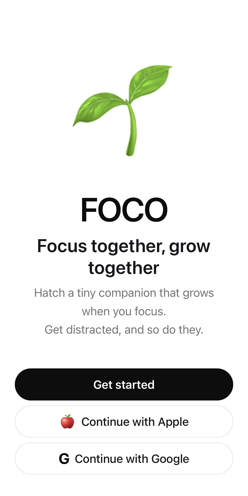
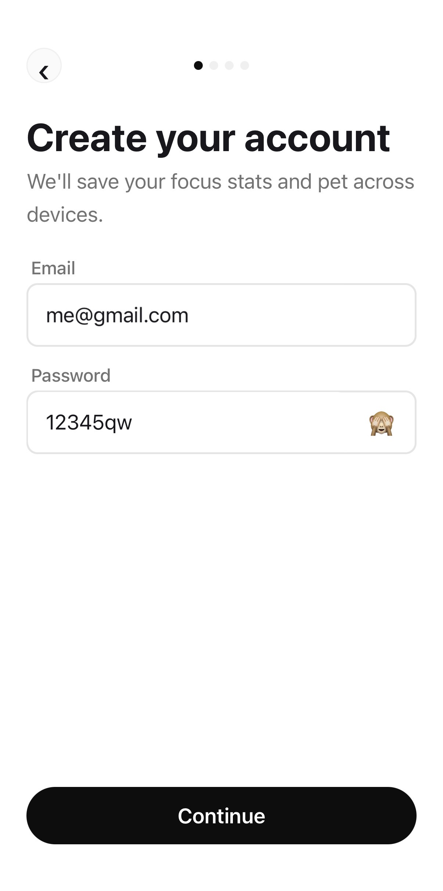
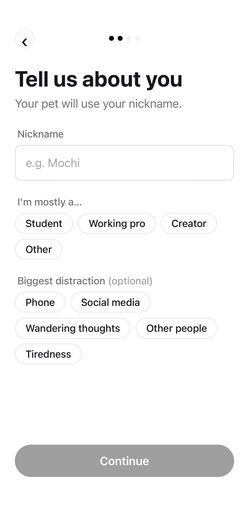
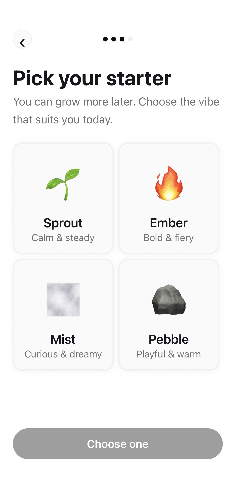
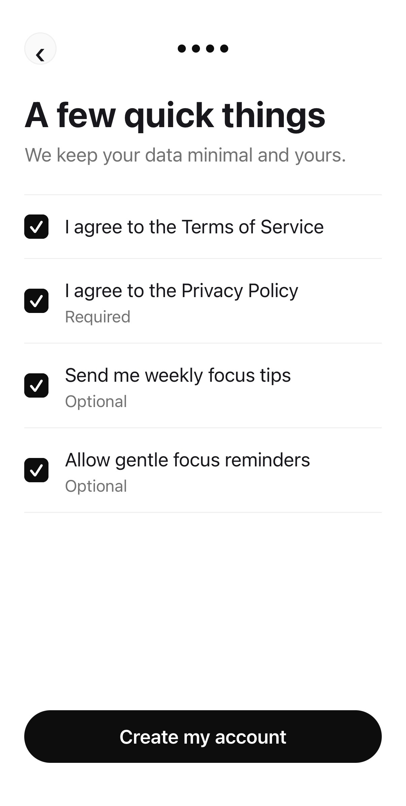
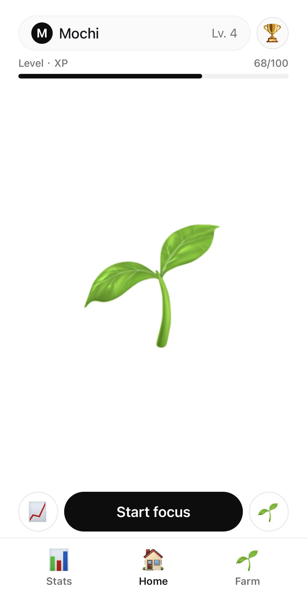
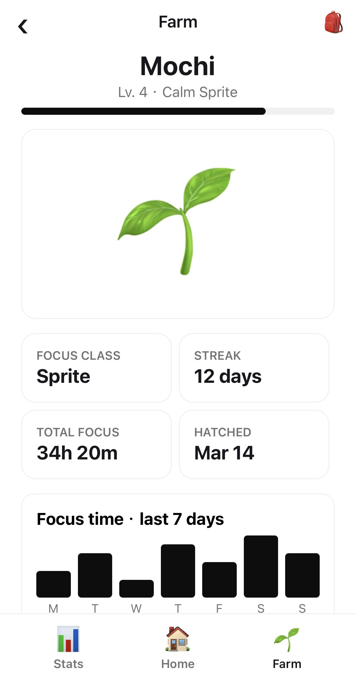
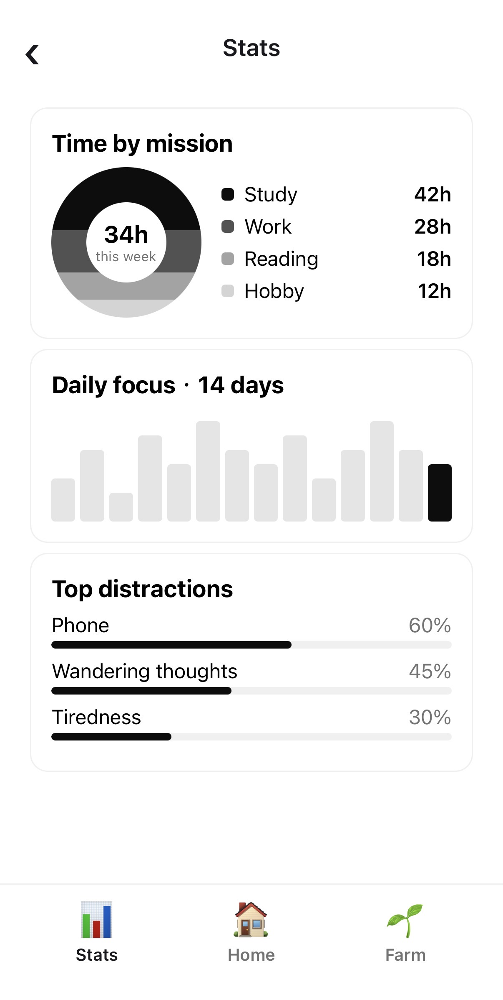
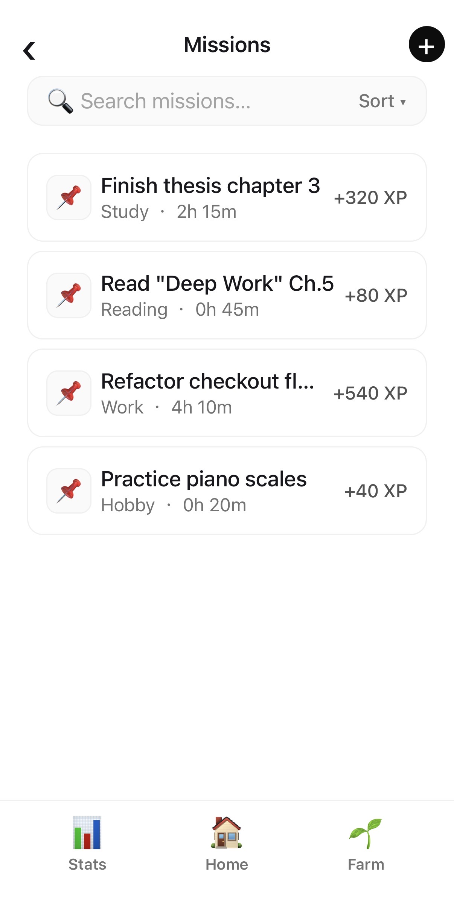
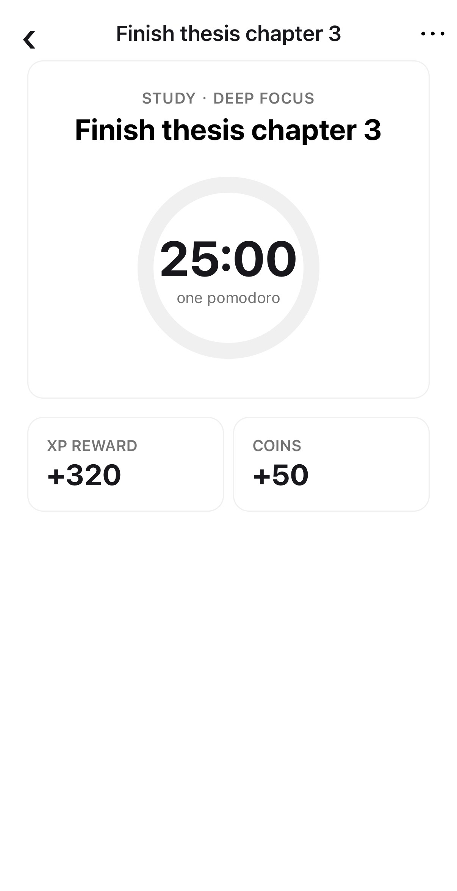

# FOCO - Focus Companion

## Proposal Report

### 動機與目標

<!-- 說明為什麼想做這個專題 -->

專注力管理、習慣養成與數位自控已不是小眾需求，而是穩定成長的產品類別。Business of Apps 2025 年的統計指出，整體 productivity 類 app 在 2024 年創造超過 **120 億美元**收入，代表市場對時間管理與效率工具的需求非常穩定。

然而，需求穩定不代表使用者滿意——多數工具的 30 天留存率仍低於 15%。問題不在於工具不夠多，而在於現有工具只解決「開始計時」，卻沒有處理**為什麼人會在計時中放棄、以及如何讓人想繼續回來**。

**目標族群：**
- 大學生、研究生（有自主學習需求）
- 準備考試的人
- 有 side project 或高自律需求、但容易分心的人

這群人的共同情境是：明知道今天要做什麼，卻很難穩定開始；開始後容易被手機、社群、雜念打斷；做完後只知道自己花了時間，卻不清楚自己是怎麼分心的；使用 app 一開始新鮮，幾天後就失去動力。

**FOCO 的核心設計策略：「儀式感 ＋ 微反思」**
不採用全自動背景監控（使用者對被監控有心理門檻，且跨裝置實作困難），改用**主動參與**的方式：計時結束後，彈出一個極簡的輸入框——「這段時間內，你完成了什麼？有分心嗎？」——用這個儀式收集數據，同時讓使用者建立自我觀察的習慣。完成後獎勵進入背包，寵物隨之成長，形成「**專注 → 微反思 → 獎勵 → 回訪**」的正向循環。

**長期願景：** 根據累積的反思紀錄，歸納使用者的專注風格類型（如「衝刺型」、「易分心型」），提供個人化建議，並開放社交連動功能增加使用黏著度。

---

### 競品比較

<!-- 比較目前已經存在可取得的類似工具或應用 -->

現有產品大致分為三類，各有不同的痛點：

**第一類：專注計時型**（Forest、YPT）
強項是計時、限制中斷、或利用同儕壓力維持專注。痛點是偏重「時間有沒有撐完」，較少處理「中途為何分心」，對分心原因的紀錄與理解不足，部分產品偏強制，可能帶來焦慮或排斥感。

**第二類：任務遊戲化型**（Habitica）
把任務、習慣與回饋包裝成 RPG 系統，有金幣、裝備與升級。痛點是遊戲化程度高，但任務管理與自我反思未必貼近真實專注情境，系統可能過於複雜，反而增加使用負擔。

**第三類：療癒待辦型**（WaterDo）
主打完成任務後透過視覺與音效帶來紓壓感。痛點是回饋體驗完整，但偏向任務完成後的情緒療癒，對專注過程中的分心觀察與長期習慣形成支援較弱。

**功能特色對比：**

| 功能特色 | FOCO ★ | Forest | Habitica | WaterDo | YPT |
|----------|--------|--------|----------|---------|-----|
| 專注計時器 | ✅ | ✅ | ✅ | ✅ | ✅ |
| 分心原因追蹤 | ✅ | ❌ | ❌ | ❌ | ❌ |
| 微反思機制 | ✅ | ❌ | ❌ | ❌ | △ |
| 遊戲化回饋 | ✅ | ✅ | ✅ | ✅ | ❌ |
| 個人風格洞察 | ✅ | ❌ | ❌ | ❌ | ❌ |
| 情緒 / 心理陪伴 | ✅ | △ | ❌ | △ | ❌ |

> △ = 部分支援　❌ = 不支援　✅ = 完整支援

**差異化重點：** FOCO 是唯一同時做到「遊戲化回饋」＋「分心原因追蹤」＋「微反思機制」的工具，且以寵物養成取代強制監控，降低使用者心理門檻。

---

### 預期功能

<!-- 列出預計實作的功能 -->

**使用者系統**
- Email 註冊 / 登入（含 Token 持久化）
- 個人化暱稱設定
- 寵物初始選擇與命名

**專注計時器**
- 自訂任務名稱與計時長度
- 倒數計時器（可中斷、完成、失敗）
- 計時結束後觸發微反思介面（「這段時間完成了什麼？有分心嗎？」）
- 提前中斷時可標記分心原因（手機、社群、雜念、疲勞等）
- 完成後將專注輪次轉換為寵物成長素材（能量、金幣）
- 歷史任務紀錄（已完成 / 失敗 / 中斷）

**寵物系統**
- 虛擬寵物（以 emoji 表示）
- 根據專注表現提升等級與心情
- 寵物狀態顯示（心情、等級、經驗值）

**背包系統**
- 道具分類管理
- 道具使用（補充寵物能量、提升獎勵倍率等）

**數據統計**
- 每日 / 每週專注時長圖表
- 顯示「你最近最常被什麼打斷」（分心原因分佈）
- 系統根據紀錄給予簡單建議（如：「你最容易在下午分心，試試把重要任務排在早上」）

**長期規劃（Final 階段視進度實作）**
- 專注風格標籤（依據反思紀錄歸納使用者類型）
- 分享機制（分享寵物狀態與做事風格至社群）
- 社交連動（與朋友的寵物互動，如幫對方餵食）

---

### 使用技術

<!-- 使用的語言、框架、工具等 -->

| 層級 | 技術 |
|------|------|
| 框架 | React Native（Expo SDK 54） |
| 路由 | Expo Router v6（file-based routing） |
| 狀態管理 | Zustand v5 |
| HTTP 客戶端 | Axios（含 interceptor） |
| 本地儲存 | expo-secure-store（Token）、AsyncStorage（快取） |
| 語言 | TypeScript |
| 樣式 | StyleSheet（自定義 Design Tokens） |
| 後端（規劃） | Node.js + REST API |

---

### 課程關聯 — 資料結構分析

FOCO 各核心模組的狀態皆以 Zustand store 集中管理。本節針對「分心原因統計」功能，完整比較三種不同設計方案在時間複雜度、空間複雜度與實際操作次數上的差異，最後說明其餘模組的結構選擇。

---

#### 深度分析：分心原因統計（Top Distractions）

**功能描述**

每次計時結束後，使用者從 6 個選項中選出這次最主要的分心原因；Stats 頁面即時顯示「你最常被什麼打斷」排行榜，並計算各原因的佔比百分比。此功能涉及兩個核心操作：

- **寫入（record）**：每次計時結束觸發一次，記錄一個分心原因
- **查詢（query）**：每次進入 Stats 頁面時觸發，需取得排序後的頻率列表

設 n = 使用者的歷史分心紀錄總筆數，k = 不同原因的種類數（FOCO 固定為 6 種），以下比較三種實作方案。

---

**方案 A — 原始陣列（Flat Array）**

每次記錄分心時，將原因字串直接 push 進一個陣列。

```ts
// 資料結構
distractionLog: string[]
// e.g. ['Phone', 'Tiredness', 'Phone', 'Phone', 'Wandering thoughts', ...]

// 寫入
recordDistraction: (reason) => {
  set({ distractionLog: [...get().distractionLog, reason] });
}

// 查詢（每次進 Stats 頁都重新掃描）
getTopDistractions: () => {
  const log = get().distractionLog;          // n 筆
  const countMap: Record<string, number> = {};
  for (const r of log) {                     // O(n)
    countMap[r] = (countMap[r] ?? 0) + 1;
  }
  return Object.entries(countMap)
    .map(([reason, count]) => ({ reason, count, pct: count / log.length }))
    .sort((a, b) => b.count - a.count);      // O(k log k)，k=6 → 常數
}
```

| 操作 | 時間複雜度 | 說明 |
|------|-----------|------|
| 寫入 | O(1) | Array spread 附加到尾端 |
| 查詢 | **O(n)** | 每次都要掃描全部 n 筆歷史紀錄 |
| 空間 | **O(n)** | 完整保留每一筆紀錄字串 |

**問題：** 查詢成本隨使用者紀錄累積線性增長。假設使用者每天做 4 次番茄鐘，連用 6 個月後 n ≈ 720，每次進 Stats 頁都要掃 720 個字串。紀錄越多，延遲越明顯。

---

**方案 B — 預計算 HashMap（目前實作）**

不儲存每一筆原始字串，改為在寫入時直接累加計數，以 `reason` 字串為 key，次數為 value。

```ts
// 資料結構
distractionMap: Record<string, number>
// e.g. { Phone: 47, Tiredness: 18, 'Wandering thoughts': 22, ... }

// 寫入：O(1)，直接 key lookup 並遞增
recordDistraction: (reason) => {
  const map = get().distractionMap;
  set({ distractionMap: { ...map, [reason]: (map[reason] ?? 0) + 1 } });
}

// 查詢：O(k log k)，k=6 固定，實質為 O(1)
getTopDistractions: () => {
  const map = get().distractionMap;
  const total = Object.values(map).reduce((s, n) => s + n, 0);  // O(k)
  if (total === 0) return [];
  return Object.entries(map)
    .map(([reason, count]) => ({ reason, count, pct: count / total }))
    .sort((a, b) => b.count - a.count);  // O(k log k)，k≤6
}
```

| 操作 | 時間複雜度 | 說明 |
|------|-----------|------|
| 寫入 | O(1) | Hash key 存取，一次遞增 |
| 查詢 | **O(k log k) ≈ O(1)** | k=6 固定，與 n 無關 |
| 空間 | **O(k)** | 只存 6 個計數值，不隨 n 增長 |

**優勢：** 查詢成本完全與歷史紀錄筆數 n 脫鉤。無論使用者用了 1 個月還是 1 年，每次查詢只需處理 6 個 key，記憶體佔用也維持固定。

---

**方案 C — Min-Heap（Top-K 情境的極致優化）**

若未來分心原因的種類數 k 不再是固定值（如開放自定義原因），且只需要取前 K 名（K << k），可進一步使用 Min-Heap：維護一個大小為 K 的最小堆，每次插入新原因時只保留 top K，避免對所有 k 個原因排序。

```
建立 Heap（K=3）：O(k log K)
每次新增後更新：O(log K)
查詢 top-K：O(K log K)
```

| 操作 | 時間複雜度 |
|------|-----------|
| 寫入 | O(log K) |
| 查詢 Top-K | O(K log K) |
| 空間 | O(K) |

**FOCO 的選擇：** k 固定為 6，K = 5，Min-Heap 相比方案 B 帶來的改善不顯著，且實作成本高（JavaScript 無內建 Heap，需手刻）。方案 B 在此場景已是最佳實際選擇。

---

**三方案效能比較總結**

| | 方案 A（Flat Array） | 方案 B（HashMap）✅ | 方案 C（Min-Heap） |
|---|---|---|---|
| 寫入 | O(1) | O(1) | O(log K) |
| 查詢 | O(n) | O(k log k) ≈ O(1) | O(K log K) |
| 空間 | O(n) | O(k) | O(K) |
| 實作難度 | 低 | 中 | 高 |
| 適合場景 | n 極小、需保留原始序列 | k 固定、高頻查詢 | k 極大、只需 top-K |

**結論：** 方案 B（HashMap）在 FOCO 的實際情境中同時滿足「寫入快、查詢快、記憶體省」三個目標，且已在 `gameStore.ts` 中實作並串接至 Stats 頁面。

---

#### 其他模組的結構選擇

**寵物狀態（Pet）** — 單一 Object，欄位包含 `name`、`level`、`exp`、`mood`。全 App 只有一隻寵物，Object 直接 key 存取比 Array 直觀，更新只需 partial update，不需要集合型結構。

**計時器（Timer）** — 單一 Object（`activeMission`），每秒透過 `tickMission()` 將 `remainingSeconds -= 1`，倒數至 0 觸發 FSM 轉移（`timer → reflection`）。同一時間只有一個計時器執行，不需要佇列。

**任務紀錄（Missions）** — Array of Objects（`accomplishedMissions[]`）。任務需要依序渲染且支援過濾，新任務附加在陣列頭部（unshift，O(n)），數量有限不構成效能問題。若未來需要大量歷史任務查詢，可改為以 `id` 為 key 的 HashMap。

---

### Prototype 預計可驗證內容

1. **Onboarding 流程可走通**：Welcome → 註冊 → 設定暱稱 → 選擇寵物 → 同意條款 → 進入主畫面
2. **任務計時核心**：建立任務 → 倒數計時 → 結束後觸發微反思介面 → 發放獎勵並更新寵物狀態
3. **分心原因記錄**：中途中斷時可標記分心原因，並在統計頁顯示「最常被什麼打斷」
4. **寵物畫面顯示**：顯示寵物狀態（等級、心情）並隨任務完成更新
5. **UI 設計語言一致**：黑白極簡 iOS 風格，全站統一 Design Token

---

## Prototype Report

### Demo — 目前執行畫面

以下為 Prototype 在 iPhone 上透過 Expo Go 實際執行的截圖。

#### Onboarding 流程

<div style="display:flex; flex-wrap:wrap; gap:16px; align-items:flex-start;">
  <div style="text-align:center">
    <br/>
    <small>1. Welcome</small>
  </div>
  <div style="text-align:center">
    <br/>
    <small>2. Create account</small>
  </div>
  <div style="text-align:center">
    <br/>
    <small>3. Tell us about you</small>
  </div>
  <div style="text-align:center">
    <br/>
    <small>4. Pick your starter</small>
  </div>
  <div style="text-align:center">
    <br/>
    <small>5. A few quick things</small>
  </div>
</div>

#### 主畫面（Main App）

<div style="display:flex; flex-wrap:wrap; gap:16px; justify-content:center;">
  <div style="text-align:center">
    <br/>
    <small>Home — 寵物狀態 ＋ 開始專注</small>
  </div>
  <div style="text-align:center">
    <br/>
    <small>Farm — 寵物詳情 ＋ 7 天專注圖</small>
  </div>
  <div style="text-align:center">
    <br/>
    <small>Stats — 專注統計 ＋ 分心原因</small>
  </div>
  <div style="text-align:center">
    <br/>
    <small>Missions — 任務列表 ＋ XP 獎勵</small>
  </div>
  <div style="text-align:center">
    <br/>
    <small>Mission Detail — 計時器 ＋ 獎勵預覽</small>
  </div>
</div>

---

### 目前進度

<!-- 完成了什麼 -->

- ✅ 完成專案架構建立（Expo Router + Zustand + TypeScript）
- ✅ 完成 Onboarding 全流程畫面（6 個頁面）
- ✅ 完成主應用畫面（Home、Farm、Stats、Missions、Mission Detail）
- ✅ 建立 Zustand Stores（authStore、userStore、gameStore）
- ✅ 建立 API 服務層（auth、user、game）
- ✅ Design Token 系統（顏色、字體、間距、圓角）
- ✅ PetAvatar 元件（動畫浮動、表情切換）
- ✅ 成功在 iPhone 上透過 Expo Go 執行
- ✅ Timer FSM 實作（detail → timer → reflection → accomplished 四階段狀態機）
- ✅ 微反思介面（計時結束後觸發分心原因選擇，6 個選項 chip）
- ✅ 分心原因 HashMap（`distractionMap: Record<string, number>`，O(1) 更新與查詢）
- ✅ 任務完成串接 XP + coins 結算（`addExperience` / `addCoins`）
- ✅ Stats 頁面從真實 HashMap 讀取 Top distractions

---

### 遇到的困難

<!-- 遇到什麼問題、如何解決或打算如何解決 -->

**1. Expo SDK 版本與 Expo Go 不相容**
- 問題：原始 package.json 使用 SDK 51，但 iPhone 上的 Expo Go 僅支援 SDK 54
- 解法：手動升級所有 Expo 相關套件至 SDK 54 對應版本

**2. New Architecture 啟動崩潰**
- 問題：`app.json` 中設定 `"newArchEnabled": false` 導致 TurboModuleRegistry 錯誤
- 解法：移除該設定，讓 Expo Go 使用預設的 New Architecture

**3. Expo Router 進入點設定錯誤**
- 問題：`package.json` 的 `main` 指向 `index.ts`，導致 Expo Router 無法接管路由
- 解法：改為 `"expo-router/entry"`

**4. `@/` 路徑別名無法解析**
- 問題：tsconfig 缺少 `baseUrl` 與 `paths` 設定
- 解法：補上 `"baseUrl": "."` 與 `"paths": { "@/*": ["./*"] }`

**5. 套件缺失（babel-preset-expo、expo-linking、expo-splash-screen）**
- 問題：部分 Expo 核心套件未安裝在 node_modules
- 解法：逐一透過 `npm install --legacy-peer-deps` 補裝

---

### 下一步計畫

<!-- 接下來要做什麼 -->

- [x] ~~實作計時結束後的微反思介面~~（已完成，4 階段 FSM）
- [x] ~~分心原因 HashMap 統計 + 「最常被什麼打斷」顯示~~（已完成）
- [x] ~~數據統計圖表（專注時長、分心原因分佈）~~（已完成，Stats 頁）
- [ ] 串接後端 API（登入 / 任務 CRUD）
- [ ] 寵物等級系統細化（等級上限、升級動畫）
- [ ] 系統簡單建議邏輯（rule-based，依分心原因給提示）
- [ ] 螢幕使用監控（AppState API，偵測切換 App 行為）
- [ ] 專注風格分類（根據分心紀錄累積後歸納類型標籤）

---

## Final Report

### 專案說明

FOCO 是一款專為大學生與自由工作者設計的專注力養成行動應用程式，結合番茄鐘計時、微反思機制與虛擬寵物培育，形成「**專注 → 微反思 → 獎勵 → 回訪**」的正向循環。

#### 核心模組

**1. 專注計時器（Timer）**
使用者設定任務名稱與計時時長後啟動計時。時間結束後觸發微反思介面，引導使用者回答「這段時間完成了什麼？有分心嗎？」收集的數據用於統計分析；若提前中斷，可手動標記分心原因。完成後，專注輪次自動轉換為寵物成長素材（能量與金幣），獎勵進入背包，寵物狀態隨之更新。

**2. 寵物系統（Pet）**
每位使用者擁有一隻虛擬寵物，寵物等級與心情反映專注表現——連續完成任務可讓寵物升級，長時間未互動則情緒下滑。寵物以動態 emoji 呈現，具備浮動動畫與心情切換效果。

**3. 個人風格洞察（Stats）**
系統記錄每日與每週的專注時長、任務完成率、常見分心原因，顯示「你最近最常被什麼打斷」，並根據紀錄給予簡單建議（如：「你最容易在下午分心，試試把重要任務排在早上」）。

**4. 背包系統（Backpack）**
完成任務獲得的道具存放於背包，可用於補充寵物能量或提升下次任務的獎勵倍率。

#### 技術架構

```
foco-app/
├── app/
│   ├── _layout.tsx          # Root layout，含 session 恢復與路由守衛
│   ├── (auth)/              # 未登入流程：歡迎、註冊、個人設定、選寵物、同意、完成
│   └── (app)/               # 主應用：首頁、計時、任務、統計、背包
├── stores/
│   ├── authStore.ts         # 登入狀態、Token 管理（SecureStore 持久化）
│   ├── userStore.ts         # 使用者資料、寵物狀態、等級計算
│   └── gameStore.ts         # 任務倒數、背包道具
├── services/                # Axios API 層（auth、user、game）
├── components/              # 共用元件（PetAvatar、AppHeader 等）
└── constants/theme.ts       # Design Tokens（顏色、字體、間距、圓角）
```

### Demo 影片

> YouTube 連結：<!-- 請貼上影片連結 -->

---

### 使用方式

#### 環境需求

- Node.js 18 以上
- iPhone 安裝 **Expo Go**（App Store 免費下載，需支援 Expo SDK 54）
- 與開發電腦連接至**同一個 Wi-Fi 網路**

#### 安裝與啟動

```bash
# 1. 進入專案目錄
cd foco-app

# 2. 安裝相依套件
npm install --legacy-peer-deps

# 3. 啟動 Metro 開發伺服器（--clear 清除快取）
npx expo start --clear
```

#### 在 iPhone 執行

1. 開啟 iPhone 上的 **Expo Go**
2. 點選「Scan QR Code」
3. 掃描 terminal 顯示的 QR Code
4. App 即自動載入，支援 Hot Reload（存檔即更新）
